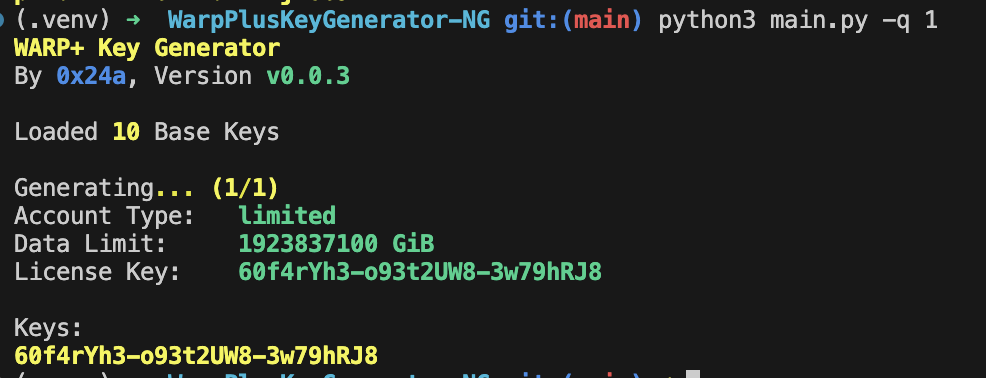

# WarpPlusKeyGenerator-NG
Cloudflare Warp+ key generator.
Generates 25PB keys by default.

## Preview


## DISCLAIMER
cloudflare please do not sue me  
i did not make this generator  
my cat just made this and uploaded it to github  
do not sue me  
sue my cat

## Something you should know
If you want to use this library in your project, please put a link to my github page! thanks!  
Also, if you don't want to make changes to this repo, DO NOT FORK THIS, because i will recieve LOTS OF notifications.  
If you just want to make a backup in case of a takedown, GIT PULL it, do NOT fork it.

## Installation
`pip3 install -r requirements.txt`.

## Usage
```
usage: python3 main.py [-h] [-q QUANTITY] [-o OUTPUT]

Generates Warp+ Keys

options:
  -h, --help            show this help message and exit
  -q QUANTITY, --quantity QUANTITY
                        Key quantity
  -o OUTPUT, --output OUTPUT
                        Output the keys to a file.

Made with ❤️ by 0x24a
```
Or just `python3 main.py`, that generates 1 key and prints it in the console.

## For developers

### register_single()
Register a WARP account. Returns the user object.

### generate_key(base_key)
Generates a WARP+ key. Returns the GenerateResults object. We have some base_keys built in.(the BASE_KEYS const)

Made by ~~24a~~ 24a's cat with ❤️  
Enjoy!